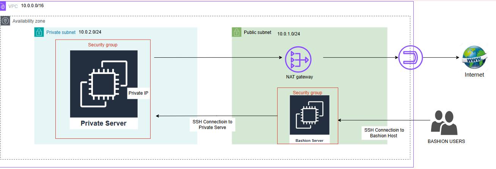

# Secure Network Architecture on AWS with Bastion Host



> **Note:** For the purposes of this project, the architecture was deployed in a single Availability Zone to simplify testing and visualization. In a production-grade or enterprise environment, this setup would be distributed across multiple Availability Zones for high availability and fault tolerance.

---

## Overview

This project demonstrates the design and implementation of a **secure, segmented network architecture** in AWS following best practices from the **AWS Well-Architected Framework**.  
It applies network isolation principles, controlled access mechanisms, and multi-layered security configurations to simulate a production-grade environment.

The project emphasizes security, scalability, and observability — all critical skills for cloud and DevOps engineers working in enterprise environments.

---

## Objectives

**Goal:** Design and implement a secure network environment with public and private subnets, routing, and controlled connectivity.

**Key Objectives:**
- Create a **custom VPC** with **public and private subnets**.
- Configure **route tables**, **Internet Gateway (IGW)**, and **NAT Gateway**.
- Deploy a **Bastion Host** for secure SSH access to private resources.
- Implement **Security Groups** and **Network ACLs** (NACLs) for defense-in-depth.
- Validate **network isolation** and **controlled connectivity** through testing.

---

## STAR Breakdown (Situation, Task, Action, Result)

### Situation
Organizations often require private workloads such as databases and application servers to be isolated from the public internet while maintaining controlled administrative access.  
The challenge was to simulate a **secure, well-architected AWS VPC** environment that enforces least-privilege access and network segmentation.

### Task
Design and deploy a secure network infrastructure that supports:
- Public and private subnets
- Controlled inbound and outbound access
- Secure connectivity via a Bastion Host
- Enforced security through layered AWS resources (SGs, NACLs, and routing)

### Action
1. **VPC Creation:**  
   - Created a custom VPC with a CIDR block of `10.0.0.0/16`.  
   - Divided into two subnets:  
     - **Public Subnet:** `10.0.1.0/24`  
     - **Private Subnet:** `10.0.2.0/24`

   *(Insert Screenshot: VPC and Subnets Configuration)*

2. **Internet Gateway and NAT Gateway:**  
   - Attached an **Internet Gateway (IGW)** to the VPC for public internet access.  
   - Deployed a **NAT Gateway** in the public subnet to allow private instances to access the internet securely for updates or package downloads without being directly exposed.

   *(Insert Screenshot: IGW and NAT Gateway Setup)*

3. **Routing Configuration:**  
   - Configured route tables:  
     - Public route table routes `0.0.0.0/0` through the IGW.  
     - Private route table routes `0.0.0.0/0` through the NAT Gateway.
   - Associated subnets accordingly.

   *(Insert Screenshot: Route Table Configuration)*

4. **Security Layers (NACLs and Security Groups):**  
   - **Network ACLs (NACLs)** were configured to explicitly control subnet-level traffic.  
     - Public subnet allows inbound HTTP(80), HTTPS(443), and SSH(22) traffic.  
     - Private subnet allows inbound traffic **only** from the Bastion Host’s subnet.  
   - **Security Groups (SGs):**
     - Bastion Host SG allows inbound SSH (22), ICMP (ping), and HTTP/HTTPS for testing connectivity.
     - Private EC2 SG only allows inbound SSH traffic from the Bastion Host’s SG — not from the internet.
   
   *(Insert Screenshot: NACL and Security Group Configuration)*

   **Reasoning:**  
   This layered security ensures only trusted traffic flows between defined resources, following the **principle of least privilege**.  
   Opening ports 80 and 443 allows web-related testing, and ICMP (ping) helps validate connectivity.  
   The Bastion Host acts as a **controlled entry point** — a standard best practice to prevent direct exposure of private workloads.

5. **Bastion Host Configuration and Port Forwarding:**  
   - Deployed a Bastion Host (Amazon Linux EC2 instance) in the public subnet with an Elastic IP for SSH access.
   - Connected securely using the private key via SSH.
   - Implemented **port forwarding** to securely access the private EC2 instance.  
     For example:
     ```bash
     ssh -i "bastion-key.pem" -L 2222:PRIVATE_EC2_IP:22 ec2-user@BASTION_PUBLIC_IP
     ```
     This setup forwards local port `2222` to the private EC2’s SSH port through the Bastion Host, allowing access without direct internet exposure.

   *(Insert Screenshot: Bastion Host Connection and Port Forwarding Example)*

   **Testing Conducted:**
   - Verified connectivity using `ping google.com` and `ping 8.8.8.8` from the private EC2 (via Bastion Host).  
   - Confirmed that private EC2 instances could reach the internet only through the NAT Gateway.  
   - Confirmed that no inbound connections were possible from the public internet to the private subnet.

   *(Insert Screenshot: Connectivity Tests and Results)*

### Result
- Delivered a **fully functional and secure VPC architecture** with public and private subnets.  
- Verified that **network isolation** was effectively enforced.  
- Established **controlled SSH access** via a Bastion Host and port forwarding.  
- Architecture follows **AWS best practices** for security, scalability, and operational excellence.  
- Demonstrated real-world cloud security implementation readiness for enterprise-scale environments.

---

## Key Design Considerations

| Component | Purpose | Security/Design Reasoning |
|------------|----------|----------------------------|
| **VPC & Subnets** | Logical network separation | Enables isolation of resources |
| **IGW & NAT Gateway** | Internet access control | Public resources access internet; private instances access updates securely |
| **Bastion Host** | Secure entry point | Prevents direct SSH exposure of private resources |
| **NACLs** | Subnet-level security | Adds a stateless layer of filtering |
| **Security Groups** | Instance-level security | Enforces least privilege and trusted source policy |
| **Routing Tables** | Traffic direction | Ensures correct packet flow and isolation between subnets |

---

## Future Improvements
If this architecture were extended for production:
- Implement **multi-AZ deployment** for high availability.
- Add **VPC Flow Logs** for network monitoring and compliance.
- Integrate **AWS Systems Manager Session Manager** for SSH-less access.
- Incorporate **CloudWatch alarms** for network performance metrics.
- Enable **Transit Gateway** for hybrid or multi-VPC environments.

---

## Outcome and Recruiter-Facing Summary (STAR-Aligned)

This project demonstrates not only hands-on AWS implementation but also **architectural reasoning**, **security design**, and **operational excellence**.  
By applying AWS best practices, the design achieves network segmentation, least-privilege enforcement, and secure access pathways — principles used by large-scale organizations worldwide.

It validates technical readiness for roles in **Cloud Infrastructure**, **DevOps Engineering**, and **Solutions Architecture** within global cloud-driven environments.

---

## Evidence and Screenshots

Please refer to the following screenshots for full verification of the setup:

- [ ] VPC and Subnet Configuration  
- [ ] Internet and NAT Gateway Setup  
- [ ] Route Table Configuration  
- [ ] Security Groups and NACLs  
- [ ] Bastion Host Connection and Port Forwarding  
- [ ] Connectivity Tests  

*(Insert all screenshots in corresponding placeholders above)*

---

## Repository Structure

Week-3-Secure-Network/
│
├── diagrams/
│ └── BASHION-ARCHITECTURE.png
│
├── screenshots/
│ ├── vpc-subnets.png
│ ├── route-tables.png
│ ├── security-groups.png
│ ├── nacl-config.png
│ ├── bastion-connection.png
│ └── connectivity-test.png
│
└── README.md


---

👨‍💻 About the Author

Samuel Nartey Otuafo
Cloud & DevOps Engineer | Oracle & AWS Certified Solutions Architect

I specialize in designing secure, scalable, and resilient cloud infrastructures that meet enterprise and compliance standards.
My focus is on bridging the gap between hands-on engineering and architectural strategy, ensuring that every deployment is both practical and production-grade.